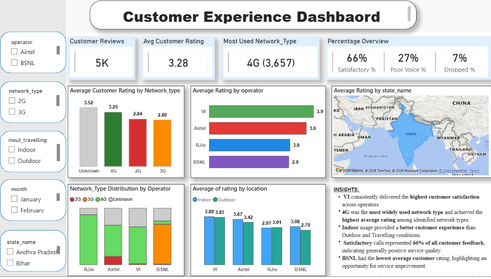

# Telecom Customer Experience Analysis using Python & Power BI

## About the Project

This project analyzes telecom customer experience data collected through the TRAI MyCall application. The objective is to understand customer satisfaction by analyzing network quality, call drops, customer ratings, and operator performance across different states in India.

Python was used for data cleaning, exploratory data analysis (EDA), and statistical testing, while Power BI was used to build an interactive dashboard for presenting business insights.

---

## Business Problems

The analysis was carried out to answer the following business questions:

- Which telecom operator has the highest customer rating?
- Is there a relationship between network type and customer rating?
- Do call drops affect customer satisfaction?
- Where are call drops more common – indoor or outdoor?
- How can these insights be presented through an interactive dashboard?

---

## Dataset

This project uses customer feedback data collected through the **TRAI MyCall** application, published by the **Telecom Regulatory Authority of India (TRAI)**.

The dataset contains customer feedback collected from telecom users across different states in India.

### Features

- Operator
- Network Type
- Rating
- Call Drop Category
- Indoor / Outdoor / Travelling
- State Name
- Latitude
- Longitude
- Month (derived from file name)

---

## Tools & Technologies

- Python
- Power BI
- Pandas
- Matplotlib
- Seaborn
- SciPy

---

## Project Workflow

1. Loaded monthly CSV files and combined them into a single dataset.
2. Cleaned the data by handling missing values, invalid values, and duplicates.
3. Created derived columns required for analysis.
4. Performed Exploratory Data Analysis (EDA) to identify trends and patterns.
5. Applied ANOVA and Chi-Square statistical tests to validate key findings.
6. Built an interactive Power BI dashboard to visualize business insights.

---

## Key Findings

- VI received the highest average customer rating in the analyzed dataset.
- BSNL recorded the lowest average customer rating.
- Customers using 4G generally reported higher ratings than those using 2G and 3G.
- Around 66% of customer feedback was classified as satisfactory.
- Outdoor locations experienced a higher percentage of call drops.
- Statistical analysis confirmed significant relationships between network type, customer rating, and call drop patterns.

---

## Dashboard

The Power BI dashboard includes:

- Overall KPIs
- Operator-wise performance analysis
- Network type distribution
- State-wise customer rating map
- Indoor vs Outdoor comparison
- Interactive filters and slicers

### Dashboard Preview

markdown


---

## Business Recommendations

- Improve network reliability in outdoor locations where call drops are more frequent.
- Focus on reducing call drops to improve customer satisfaction.
- Continue expanding and optimizing 4G network coverage.
- Use customer feedback regularly to monitor service quality and identify areas for improvement.

---

## Repository Structure

```text
Telecom-Customer-Experience-Analysis/
│
├── Dataset/
│   └── Sample_Dataset.csv
│
├── Python/
│   └── Telecom_Analysis.ipynb
│
├── PowerBI/
│   └── Telecom_Dashboard.pbix
│
├── Reports/
│   ├── Business_Report.pdf
│   └── Project_Presentation.pptx
│
├── images/
│   └── dashboard.png
│
├── README.md
└── .gitignore
```

---

## How to Run the Project

1. Clone this repository.
2. Open the Jupyter Notebook to view the data cleaning, analysis, and statistical testing.
3. Open the Power BI (.pbix) file using Microsoft Power BI Desktop.
4. Explore the dashboard using the available filters and visualizations.

---

## Author

**Karthik Kumar**

If you have any suggestions or feedback, feel free to connect with me through GitHub or LinkedIn.

---

## License

This project is created for learning and portfolio purposes.
